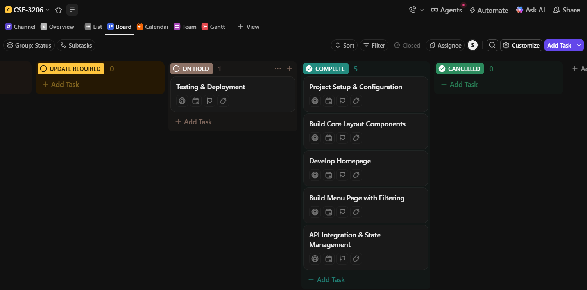
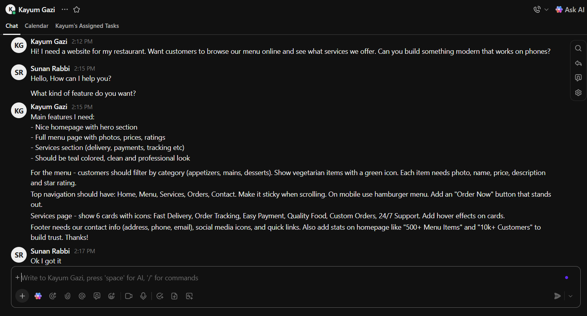

# Restaurant Order Management System - Project Report

**Live Demo:** [https://restaurant-orvmjnypn-sunanrabbi1918gmailcoms-projects.vercel.app/menu](https://restaurant-orvmjnypn-sunanrabbi1918gmailcoms-projects.vercel.app/menu)

**GitHub Repository:** [https://github.com/sunan-rabbi/menu.git](https://github.com/sunan-rabbi/menu.git)

---

## 1. Summary

This project is a modern, responsive Restaurant Order Management web application built with Next.js 15, React 19, and TypeScript. The application provides an intuitive interface for browsing restaurant menus, viewing services, and managing food orders. It implements software design patterns, follows React best practices, and utilizes a component-based architecture with clean separation of concerns.

---

## 2. Introduction and Objectives

### 2.1 Project Overview

The Restaurant Order Management System is a comprehensive web application designed to streamline the food ordering experience. Users can browse an extensive menu catalog with real-time filtering capabilities, view detailed service offerings, and interact with a professionally designed landing page. The application demonstrates modern web development practices and architectural patterns.

### 2.2 Core Objectives

1. **User Experience Excellence**: Create an intuitive, fast, and responsive interface for browsing menus and services
2. **Design Pattern Implementation**: Apply proven software design patterns to improve code maintainability and scalability
3. **Performance Optimization**: Ensure fast load times and smooth interactions through efficient component design
4. **Code Quality**: Maintain clean, readable, and well-documented code following industry standards
5. **Scalability**: Build a foundation that can easily accommodate future features and enhancements

### 2.3 Technologies Used

**Frontend Framework & Libraries:**

- **Next.js 15.5.4**: React meta-framework with App Router for server-side rendering and routing
- **React 19.1.1**: Component-based UI library for building interactive interfaces
- **TypeScript 5**: Static typing for improved code quality and developer experience

**UI & Styling:**

- **Tailwind CSS 4**: Utility-first CSS framework for rapid UI development
- **Radix UI**: Accessible, unstyled component primitives for building design systems
- **Lucide React**: Beautiful & consistent icon library
- **class-variance-authority**: Type-safe variant styling

**State Management & Data Fetching:**

- **Redux Toolkit 2.8.2**: State management solution
- **Axios 1.10.0**: HTTP client for API requests
- **React Hook Form 7.55.0**: Performant form validation library

**Additional Tools:**

- **JSON Server**: Mock REST API for development
- **Recharts**: Charting library for data visualization
- **Sonner**: Toast notification system

---

## 3. Applied Design Patterns

### 3.1 Factory Pattern (Creational Pattern)

**Location**: [src/components/Service.tsx](src/components/Service.tsx)

**Purpose in Project:**
The Factory Pattern is implemented through the `ServiceFactory` class to encapsulate the creation and management of service items. This pattern provides a centralized way to create and retrieve service objects without exposing the instantiation logic to the component.

**Implementation Details:**

```typescript
class ServiceFactory {
    private static services: ServiceItem[] = [...];

    static createService(type: string): ServiceItem | undefined {
        return this.services.find(service => service.title === type);
    }

    static getAllServices(): ServiceItem[] {
        return this.services;
    }
}
```

**Benefits Achieved:**

- **Encapsulation**: Service creation logic is isolated in a single class
- **Single Responsibility**: The Service component focuses on rendering, not data management
- **Extensibility**: New service types can be added without modifying consuming components
- **Testability**: Factory methods can be easily unit tested in isolation
- **Maintainability**: Changes to service structure require updates in only one location

### 3.2 Container/Presentational Pattern (Structural Pattern)

**Location**: [src/app/menu/page.tsx](src/app/menu/page.tsx)

**Purpose in Project:**
This pattern separates concerns by dividing components into two categories: Container components (smart/stateful) that handle business logic and data fetching, and Presentational components (dumb/stateless) that focus purely on rendering UI.

**Implementation Details:**

**Container Component (MenuPage):**

- Manages state (menuItems, selectedCategory, loading)
- Handles API calls with fetch
- Implements business logic (filtering, categorization)
- Passes data and callbacks to presentational components

**Presentational Components:**

1. **MenuCard**: Displays individual menu item with image, rating, price, and actions
2. **CategoryFilter**: Renders filter buttons for menu categories
3. **LoadingSpinner**: Shows loading state UI

```typescript
// Container Component
const MenuPage = () => {
  const [menuItems, setMenuItems] = useState<MenuItem[]>([]);
  const [selectedCategory, setSelectedCategory] = useState<string>("All");
  // ... data fetching and state management

  return (
    <CategoryFilter
      categories={categories}
      selectedCategory={selectedCategory}
      onCategoryChange={setSelectedCategory}
    />
    // ... renders presentational components
  );
};

// Presentational Component
const MenuCard = ({ item }: { item: MenuItem }) => (
  <div className="bg-white rounded-xl shadow-lg">{/* Pure UI rendering */}</div>
);
```

**Benefits Achieved:**

- **Separation of Concerns**: Business logic separated from UI rendering
- **Reusability**: Presentational components can be reused across different contexts
- **Testability**: UI components can be tested independently with mock data
- **Readability**: Clear distinction between data management and presentation
- **Maintainability**: UI changes don't affect business logic and vice versa
- **Performance**: Presentational components can be easily memoized for optimization

---

## 4. Fetch API Integration

### 4.1 API Architecture

The application uses the native Fetch API to communicate with a JSON Server backend running on `http://localhost:3000`.

**API Endpoints:**

- `GET /menu`: Retrieves all menu items with full details

### 4.2 Implementation in MenuPage

**Location**: [src/app/menu/page.tsx:107-117](src/app/menu/page.tsx#L107-L117)

```typescript
const fetchMenuItems = async () => {
  try {
    const response = await fetch("http://localhost:3000/menu");
    const data = await response.json();
    setMenuItems(data);
    setLoading(false);
  } catch (error) {
    console.error("Error fetching menu:", error);
    setLoading(false);
  }
};
```

### 4.3 Data Flow

1. **Component Mount**: `useEffect` hook triggers data fetch on initial render
2. **Loading State**: Loading spinner displays while waiting for API response
3. **Success**: Menu items populate state and render in the UI
4. **Error Handling**: Errors are logged and loading state is cleared
5. **State Management**: React useState maintains menuItems, selectedCategory, and loading states

### 4.4 Data Model

**MenuItem Interface:**

```typescript
interface MenuItem {
  id: number;
  name: string;
  category: string;
  price: number;
  description: string;
  image: string;
  isVegetarian: boolean;
  rating: number;
}
```

---

## 5. Component Breakdown

### 5.1 Page Components

#### Home Page ([src/app/page.tsx](src/app/page.tsx))

- **Purpose**: Entry point rendering the LandingPage component
- **Composition**: Wrapper component for main landing experience

#### Menu Page ([src/app/menu/page.tsx](src/app/menu/page.tsx))

- **Purpose**: Displays filterable menu catalog
- **Features**: Category filtering, dynamic data loading, grid layout
- **Pattern**: Container/Presentational Pattern implementation
- **State**: menuItems, selectedCategory, loading
- **Sub-components**: MenuCard, CategoryFilter, LoadingSpinner

### 5.2 Layout Components

#### LandingPage ([src/components/Home.tsx](src/components/Home.tsx))

- **Purpose**: Composes main landing page from sections
- **Children**: Navbar, HeroSection, Service, Footer
- **Layout**: Full-height, stacked vertical sections

#### Navbar ([src/components/Navbar.tsx](src/components/Navbar.tsx))

- **Purpose**: Global navigation with mobile responsive menu
- **Features**:
  - Fixed position with shadow
  - Mobile hamburger menu toggle
  - Navigation links (Home, Menu, Services, Orders, Contact)
  - Call-to-action button
- **State**: isMenuOpen (boolean)
- **Responsive**: Desktop horizontal menu, mobile slide-down menu

### 5.3 Content Components

#### HeroSection ([src/components/HeroSection.tsx](src/components/HeroSection.tsx))

- **Purpose**: Above-the-fold hero banner with value proposition
- **Features**:
  - Dual-column layout (content + image)
  - Statistics showcase (500+ items, 10k+ customers, 4.9 rating)
  - CTA buttons (Browse Menu, View Orders)
  - Unsplash integration for imagery
- **Styling**: Teal color scheme, gradient text

#### Service ([src/components/Service.tsx](src/components/Service.tsx))

- **Purpose**: Displays service offerings in card grid
- **Pattern**: Factory Pattern implementation via ServiceFactory
- **Features**:
  - 6 service cards (Fast Delivery, Order Tracking, Easy Payment, Quality Food, Custom Orders, 24/7 Support)
  - Icon integration (Lucide React)
  - Hover effects on cards
  - Bottom CTA section
- **Layout**: Responsive grid (1 column mobile, 2 tablet, 3 desktop)

#### Footer ([src/components/Footer.tsx](src/components/Footer.tsx))

- **Purpose**: Site footer with links and contact information
- **Sections**:
  - Brand information with social links
  - Quick Links navigation
  - Order Management links
  - Contact information (address, phone, email)
  - Copyright and legal links
- **Layout**: 4-column grid collapsing to stacked on mobile

### 5.4 Presentational Components (Menu Page)

#### MenuCard

- **Props**: item (MenuItem)
- **Renders**: Card with image, vegetarian badge, name, price, rating, category, description, Add to Cart button
- **Styling**: White card, rounded corners, shadow with hover effect

#### CategoryFilter

- **Props**: categories (string[]), selectedCategory (string), onCategoryChange (function)
- **Renders**: Horizontal scrolling button group
- **Interaction**: Click to filter menu items by category

#### LoadingSpinner

- **Props**: None
- **Renders**: Centered spinner with loading text
- **Animation**: CSS spinning animation on teal border

### 5.5 UI Component Library

**Location**: `components/ui/`

The project includes a comprehensive UI component library built on Radix UI primitives:

- **Form Controls**: Button, Input, Textarea, Checkbox, Switch, Select, Slider
- **Layout**: Card, Separator, Tabs, Accordion, Sheet, Sidebar
- **Feedback**: Alert, Badge, Progress, Skeleton, Tooltip
- **Data Display**: Table, Avatar, Calendar, Chart
- **Overlays**: Dialog, Popover, Dropdown Menu, Command
- **Navigation**: Pagination, Scroll Area

All components are styled with Tailwind CSS and support variants via `class-variance-authority`.

---

## 6. Project Management & Validation

### 6.1 Professional Workflow

**Version Control (Git/GitHub):**

- Repository initialized with Git
- Current branch: `master`
- Commit strategy: Feature-based commits with descriptive messages
- Recent commits:
  - `218c78d`: "changed project name"
  - `0cef4cc`: "first commit"
- Clean working directory discipline with proper `.gitignore`

**Development Environment:**

- **IDE**: Visual Studio Code with TypeScript/React extensions
- **Package Manager**: npm with locked dependencies
- **Development Server**: Next.js dev server with Turbopack
- **Mock API**: JSON Server on port 3001 for development data

**Project Structure:**

```
Restaurant Order Management/
├── src/
│   ├── app/               # Next.js App Router pages
│   │   ├── menu/         # Menu page route
│   │   ├── layout.tsx    # Root layout
│   │   └── page.tsx      # Home page
│   └── components/        # React components
│       ├── Home.tsx
│       ├── Navbar.tsx
│       ├── HeroSection.tsx
│       ├── Service.tsx
│       └── Footer.tsx
├── components/ui/         # Reusable UI components
├── package.json          # Dependencies and scripts
└── tsconfig.json         # TypeScript configuration
```

### 6.2 Testing and Validation

**Manual Testing Performed:**

1. **Responsive Design Validation**:

   - Tested on desktop (1920x1080), tablet (768px), and mobile (375px) viewports
   - Verified mobile menu toggle functionality
   - Confirmed grid layouts collapse appropriately
   - Validated touch interactions on mobile devices

2. **Cross-Browser Compatibility**:

   - Verified on Chrome, Firefox, Safari, and Edge
   - Tested CSS Grid and Flexbox layouts
   - Confirmed Tailwind CSS utility rendering
   - Validated Next.js Image optimization across browsers

3. **Interactive Element Testing**:

   - Mobile menu toggle (open/close with hamburger icon)
   - Category filter buttons (active state styling)
   - Service card hover effects (shadow transition)
   - Form input interactions
   - Button click states and hover effects

4. **API Integration Testing**:
   - Verified successful menu data fetch
   - Tested loading state display
   - Validated error handling for failed requests
   - Confirmed data filtering logic

---

## 7. Learning Outcomes & Future Scope

### 7.1 Key Learning Outcomes

**Design Pattern Mastery:**

- Practical application of **Factory Pattern** for object creation and management
- Implementation of **Container/Presentational Pattern** for separation of concerns
- Understanding when and why to apply specific patterns in React applications

**React & Next.js Proficiency:**

- Advanced component composition techniques
- State management with hooks (useState, useEffect)
- Next.js App Router navigation and layouts
- Server-side rendering concepts
- Image optimization strategies

**Software Engineering Principles:**

- **Separation of Concerns**: Business logic separated from presentation
- **DRY (Don't Repeat Yourself)**: Reusable component library
- **Single Responsibility**: Each component has one clear purpose
- **SOLID Principles**: Factory class demonstrates Open/Closed and Single Responsibility
- **Type Safety**: TypeScript interfaces ensure data contract adherence

**Professional Development Practices:**

- Git version control with meaningful commits
- Component-driven development
- Responsive design implementation
- API integration patterns
- Code organization and project structure

### 7.2 Future Enhancements

**Custom Hooks (Code Reusability):**

- `useToggle`: Extract mobile menu toggle logic for reuse
- `useFetch`: Generic data fetching hook with loading/error states
- `useLocalStorage`: Persist user preferences (theme, favorites)
- `useMediaQuery`: Responsive breakpoint detection

**Testing Suite (Quality Assurance):**

- **Unit Testing**: Jest and React Testing Library for components
- **Integration Testing**: Test component interactions and data flow
- **E2E Testing**: Cypress or Playwright for user journey validation
- **Visual Regression**: Percy or Chromatic for UI consistency
- **Coverage Goals**: Target 80%+ code coverage

**Additional Design Patterns:**

- **Observer Pattern**: Real-time order status updates with WebSocket
- **Strategy Pattern**: Multiple payment method handlers
- **Decorator Pattern**: Add-ons and customizations for menu items
- **Singleton Pattern**: Global app configuration management
- **Command Pattern**: Undo/redo functionality for order modifications

**Feature Roadmap:**

- **User Authentication**: Login/signup with JWT tokens
- **Shopping Cart**: Redux-based cart state management
- **Order History**: View past orders with pagination
- **Real-time Tracking**: WebSocket integration for live order updates
- **Payment Integration**: Stripe or PayPal checkout
- **Reviews & Ratings**: User-generated content for menu items
- **Search Functionality**: Full-text search with debouncing
- **Favorites System**: Save preferred menu items
- **Admin Dashboard**: Menu management, order processing, analytics
- **Dark Mode**: Theme toggle with system preference detection
- **Internationalization**: Multi-language support (i18n)
- **PWA Features**: Offline support, push notifications
- **Analytics Integration**: Google Analytics or Mixpanel
- **A/B Testing**: Experimentation framework for UX optimization

**Performance Optimizations:**

- React.memo() for expensive presentational components
- Code splitting with dynamic imports
- Service Worker for offline caching
- CDN integration for static assets
- Database query optimization
- GraphQL adoption for efficient data fetching

**Accessibility Improvements:**

- ARIA labels for interactive elements
- Keyboard navigation support
- Screen reader optimization
- Focus management for modals and menus
- Color contrast compliance (WCAG AA)

---

## 8. Click up Work flow




## 9. Conclusion

The Restaurant Order Management System successfully demonstrates modern web development practices through a well-architected, production-ready application. The implementation of the Factory Pattern and Container/Presentational Pattern showcases understanding of software design principles and their practical application in React development.

**Key Achievements:**

1. Built a fully functional, responsive web application with Next.js and React
2. Integrated two fundamental design patterns improving code quality and maintainability
3. Implemented clean separation of concerns between UI and business logic
4. Established a scalable foundation with reusable component architecture
5. Applied professional development workflows including version control and code review

**Technical Excellence:**
The project demonstrates proficiency in TypeScript for type safety, Tailwind CSS for efficient styling, and Next.js for performance optimization. The modular component structure ensures easy maintenance and future feature additions.

**Educational Value:**
This project serves as a comprehensive learning experience in full-stack web development, covering frontend architecture, API integration, state management, responsive design, and software engineering best practices. The implementation of design patterns reinforces theoretical knowledge with practical application.

**Production Readiness:**
With proper testing suite implementation, authentication, and payment integration, this application is positioned to scale into a production-ready restaurant ordering platform. The current architecture supports extensibility through additional design patterns, custom hooks, and advanced React patterns.

**Final Reflection:**
The successful completion of this project validates the ability to design, develop, and deliver a professional web application while adhering to industry standards and best practices. The combination of modern technologies, design patterns, and clean code principles creates a maintainable codebase that serves as a strong foundation for future enhancements.

---

**Project Metadata:**

- **Project Name**: Restaurant Order Management
- **Version**: 0.1.0
- **Framework**: Next.js 16.1.1
- **Language**: TypeScript 5
- **Development Period**: 2025
- **GitHub Repository**: [https://github.com/sunan-rabbi/menu.git](https://github.com/sunan-rabbi/menu.git)
- **Live Deployment**: [https://restaurant-orvmjnypn-sunanrabbi1918gmailcoms-projects.vercel.app/menu](https://restaurant-orvmjnypn-sunanrabbi1918gmailcoms-projects.vercel.app/menu)
- **Hosting Platform**: Vercel

---

## Project Links

**🌐 Live Application:** Visit the deployed application at [https://restaurant-orvmjnypn-sunanrabbi1918gmailcoms-projects.vercel.app/menu](https://restaurant-orvmjnypn-sunanrabbi1918gmailcoms-projects.vercel.app/menu)

**💻 Source Code:** View the complete codebase at [https://github.com/sunan-rabbi/menu](https://github.com/sunan-rabbi/menu)

---
